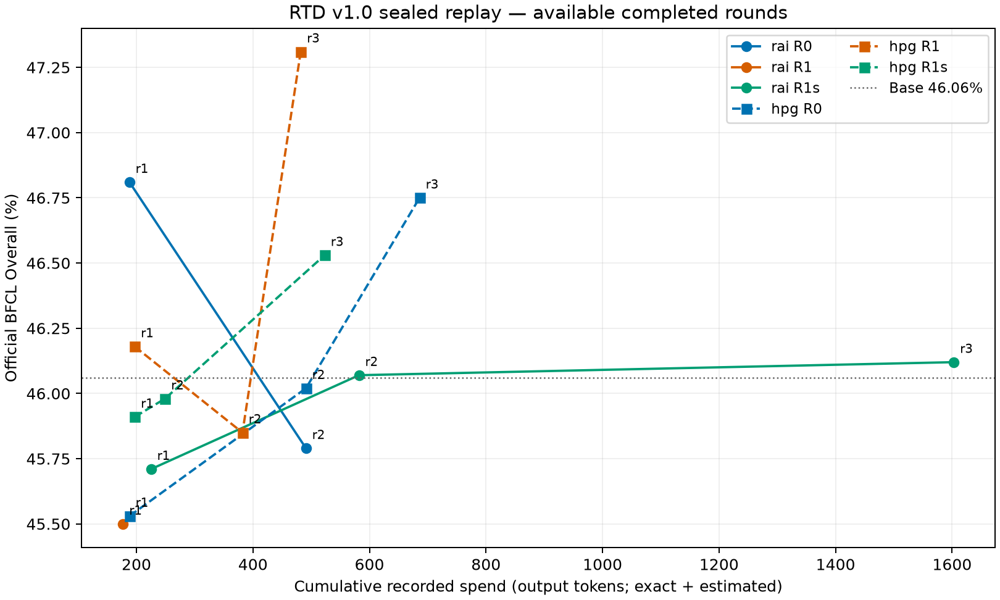

# RTD v1.0(BFCL,sealed_replay)汇总与判断 — 2026-09-09

单种子(seed 0)。六个 run = 三个方法臂(R0 随机采购+固定 a=.5;R1 完整 RTD;R1s 学习标量门控)× 两台机器(hpg B200;rai 三种卡),**不是**多种子重复。**参照线更正(04:30Z)**:六个 run 的基座都是原始 Qwen/Qwen3.5-4B 学生(manifest model_path = HF 快照 851bf6e8),其官方分为 **46.06**;此前写的 46.74 是 crcd_r3_union_t_s0 的分数,标错。相对 46.06:hpg R1 r3 +1.25、R0 +0.69、R1s +0.47,仍在单种子噪声内;基座未见过 bank(无泄漏)。完成度:hpg 三臂三轮全部完成;rai R1s 完成;rai R1 第 2 轮评测进行中;rai R0 第 3 轮等 GPU。未完成格子标"未完成",出来后补发。

## 1. 结论:v1.0 RTD 在 BFCL 上没有信号,原因是协议没有让方法工作

| 臂(hpg B200 同机) | r1 | r2 | r3 | 累计包 / token |
|---|---|---|---|---|
| R0 随机 | 45.53 | 46.02 | **46.75** | 7 / 686 |
| R1 完整 RTD | 46.18 | 45.85 | **47.31** | 5 / 482 |
| R1s 标量门控 | 45.91 | 45.98 | **46.53** | 6 / 523 |
| rai R1s(RTX PRO) | 45.71 | 46.07 | 46.12 | 7 / 1,603 |
| rai R0(Ada) | 46.81 | 45.79 | 未完成 | 5 / 491 |
| rai R1(A100) | 45.50 | 未完成 | 未完成 | 4 / 356 |

- 三轮终点极差 0.78,R1 − R0 = +0.56;全部在 base ±1.3 内。分轴(NL/Live/MT/Mem/Irrel/Web)没有任何一轴系统性移动。
- 同一购买序列跨机器:R0 r1 差 −1.28、r2 差 +0.23——机器效应本身就有噪声带那么大,rai 与 hpg 的数字不能互比。
- **判断:这不是"RTD 无效"的证据,也不能支持"RTD 有效"。** 三个可量化的结构性原因如下。

## 2. 为什么没有信号(全部来自日志)

1. **采购量结构性过小。** 每窗最多 1 包、12 窗;实际每臂买 5–7 包、482–1,603 token,占 bank 实际内容(55,370 token)的 0.9–2.9%。预算上限按公开 cap 定为 825k / 2.06M / 4.13M,是内容的 15–75 倍,任何点都不可能绑定(支出/ceiling 0.01–0.04%)。
2. **价值模型没有在"选"。** 每窗候选 ~308(奇数轮,折 0)或 ~110(偶数轮,折 1)包;R1/R1s 的 empty 概率 48–51%(先验 0.5),包条件熵比 0.998–1.000——与 R0 的均匀分布(熵比 1.000)不可区分。成本模型冷启动用公开 cap(65,536 / 8,192)预测,所有候选看起来同样贵。学习价值在这个采购量与成本尺度下没有改变任何决策。
3. **传输目标的自身质量项在放大采样噪声。** 温度 1 采样的反馈 rollout 中格式错误动作逐轮上升:hpg R0 0/18/33、R1 0/12/24、R1s 46/7/36,rai R1s 0/10/40——随机臂同样上升。核对代码与 journal:参数更新只来自传输目标梯度(reference_gradient / new_package_gradient → commit_step),回报梯度只进 gate_vjp(门控 φ)与插入价值,**没有 RL 步更新骨干**。机制是 (1−a)·(−log p_t(自采样动作)):来源动作是学生自己在温度 1 下的采样(每状态 2 个),且未按格式过滤,格式错误的自采样同样被最大化似然;a=.5 时一半质量落在这项,12 步/轮累积 → 温度 1 解析失败率逐轮上升。greedy 官方分尚未受影响。(此条在 03:47Z 按用户核对意见修正;原稿误归因于 REINFORCE 步。)

## 3. 需要改的地方(按优先级)

1. **预算与采购量(协议 v1.1,方案已写:docs/rtd_v1_1_budget_quota_plan_zh.md)**:分母改为 bank 实际内容 55,370(10/25/50% = 5,537 / 13,843 / 27,685);每类 cap 改为按冻结 bank 内容认证(demo 2,048 / generator 512,需批准一个信息例外);每窗按配额买 K≈20 包、M=40 次子决策、余额结转;曝光 8→40 槽、每新包 2 槽。R0 用同一配额随机买。
2. **重跑前先做半天的"价值信号可靠性"测试**:在同一参考点(hpg R1 第 1 轮第 1 步 checkpoint)用两组独立种子的反馈 rollout 各算一遍全部候选的插入价值 v_q,看 Spearman 相关与 top-20 重叠,再用加倍 rollout 重复。相关 ≈ 0 → 先加反馈 rollout 预算(否则 K=20 重跑只是换了包装的随机采购);相关明显 >0 → 直接六臂重跑。这个测试不改协议、不用教师 API。
3. **自身质量项的格式过滤(方法问题)**:传输目标的 (1−a) 自采样项只保留可解析(通过 checker 语法检查)的自采样,或让门控把格式错误来源的 a 推到 1(并把'温度 1 解析失败率'作为每轮健康指标上报);这是 v1.1 必须包含的一项,不是护栏。
4. **主比较只在 hpg B200 三臂上做**;rai 三种卡上的臂只作副本,不再当对照。
5. **诊断汇总进 report**:候选分布熵比、empty 概率、v_q 离散度/噪声比、实际 vs 预期成本、格式错误数——v1.0 全都记了但没有汇总,导致空结果的原因要事后挖 trajectory 才看得到。

## 4. 不建议做的
- 不在 v1.0 的 5–7 包池上跑强对照或固定 ledger 2×2(没有信息量;已按你的指示撤掉)。
- 不改门控特征、不加错误类型特征、不做多步 unroll、不缩减官方评测。

## 5. 其它线
- **ALFWorld**:集成完成(C26-A…H),hpg 三臂(R0/R1/R1s)已在 B200 上跑通第 1 个决策窗口并继续第 1 轮;实测一场 40 步 episode 生成约 320 s,每臂三轮 + 三次 140 题 greedy 评测约 60–70 h,接力作业已排;第一个官方数约明晚(美东)。
- **v1.1 实现**:按你的要求暂停,等 §3.1 五项批复(docs/2026-09-09-rtd-v1-summary-and-v1-1-recommendations-zh.md §2.6)。

---
# 附:自动汇总表(tools/rtd_v1_collect_report.py,截至 2026-09-09 03:45Z)
## 官方 Overall（%）

| 机器 | 臂 | r1 Overall | r2 Overall | r3 Overall |
| --- | --- | --- | --- | --- |
| 基座学生 | base | 46.74 | — | — |
| rai | R0 | 46.81 | 45.79 | (未完成) |
| rai | R1 | 45.50 | (未完成) | (未完成) |
| rai | R1s | 45.71 | 46.07 | 46.12 |
| hpg | R0 | 45.53 | 46.02 | 46.75 |
| hpg | R1 | 46.18 | 45.85 | 47.31 |
| hpg | R1s | 45.91 | 45.98 | 46.53 |

基座来源：--base-overall。基座分轴未提供。

## 官方分轴（6 臂 × 3 轮，%）

| 机器 | 臂 | 轮 | Overall | Non-Live AST | Live | Multi-Turn | Memory | Irrelevance | Relevance | Web Search |
| --- | --- | --- | --- | --- | --- | --- | --- | --- | --- | --- |
| 基座学生 | base | 0 | 46.74 | 未记录 | 未记录 | 未记录 | 未记录 | 未记录 | 未记录 | 未记录 |
| rai | R0 | 1 | 46.81 | 79.98 | 77.65 | 49.13 | 27.31 | 83.44 | 75.00 | 12.50 |
| rai | R0 | 2 | 45.79 | 79.58 | 77.42 | 50.00 | 24.52 | 82.81 | 75.00 | 9.50 |
| rai | R0 | 3 | (未完成) | (未完成) | (未完成) | (未完成) | (未完成) | (未完成) | (未完成) | (未完成) |
| rai | R1 | 1 | 45.50 | 79.40 | 77.72 | 50.38 | 23.23 | 83.29 | 81.25 | 8.50 |
| rai | R1 | 2 | (未完成) | (未完成) | (未完成) | (未完成) | (未完成) | (未完成) | (未完成) | (未完成) |
| rai | R1 | 3 | (未完成) | (未完成) | (未完成) | (未完成) | (未完成) | (未完成) | (未完成) | (未完成) |
| rai | R1s | 1 | 45.71 | 79.54 | 77.79 | 49.38 | 24.95 | 82.70 | 75.00 | 9.50 |
| rai | R1s | 2 | 46.07 | 80.02 | 78.09 | 49.12 | 27.96 | 83.29 | 75.00 | 8.00 |
| rai | R1s | 3 | 46.12 | 80.04 | 77.72 | 50.25 | 23.87 | 82.93 | 75.00 | 11.00 |
| hpg | R0 | 1 | 45.53 | 80.29 | 77.79 | 49.62 | 23.66 | 83.06 | 75.00 | 9.00 |
| hpg | R0 | 2 | 46.02 | 79.38 | 77.50 | 48.75 | 24.09 | 82.87 | 75.00 | 13.00 |
| hpg | R0 | 3 | 46.75 | 79.73 | 77.13 | 50.37 | 27.53 | 82.51 | 75.00 | 11.00 |
| hpg | R1 | 1 | 46.18 | 79.27 | 77.42 | 49.75 | 26.24 | 82.36 | 75.00 | 10.50 |
| hpg | R1 | 2 | 45.85 | 79.88 | 77.57 | 49.88 | 25.16 | 83.08 | 75.00 | 9.00 |
| hpg | R1 | 3 | 47.31 | 79.54 | 77.57 | 50.00 | 29.03 | 82.96 | 75.00 | 12.50 |
| hpg | R1s | 1 | 45.91 | 79.21 | 77.65 | 50.37 | 24.52 | 83.10 | 75.00 | 9.50 |
| hpg | R1s | 2 | 45.98 | 79.71 | 77.35 | 49.75 | 25.38 | 82.76 | 75.00 | 10.00 |
| hpg | R1s | 3 | 46.53 | 80.35 | 77.72 | 49.62 | 29.25 | 82.87 | 75.00 | 8.50 |

数值只取对应机器 campaign 的 data_overall.csv，不从轴分数重算 Overall。缺少 evaluation-N.json 的完整验证标记时，已有 CSV 数值仍附未完成标记。

## 采购与预算

购买数只计 teacher.jsonl 的 reveal；reserve、release 与 empty 不计购买。累计支出与 exact/estimated 均以 recorded 输出 token 计，不等同完整在线教师账单。未开始轮次不沿用上一轮支出；正在进行轮次显示已记录的部分值。

| 机器/臂 | 轮/评测状态 | 本轮包 | 累计包 | 累计支出 | cap ceiling | 支出/ceiling | exact | estimated | 支出/55,370 |
| --- | --- | --- | --- | --- | --- | --- | --- | --- | --- |
| rai/R0 | r1 | 2 | 2 | 188 | 825753 | 0.0228% | 0 | 188 | 0.340% |
| rai/R0 | r2 | 3 | 5 | 491 | 2064384 | 0.0238% | 0 | 491 | 0.887% |
| rai/R0 | r3(未完成) | 0 | 5 | 491 | 4128768 | 0.0119% | 0 | 491 | 0.887% |
| rai/R1 | r1 | 2 | 2 | 177 | 825753 | 0.0214% | 0 | 177 | 0.320% |
| rai/R1 | r2(未完成) | 2 | 4 | 356 | 2064384 | 0.0172% | 0 | 356 | 0.643% |
| rai/R1 | r3(未完成) | (未完成) | (未完成) | (未完成) | 4128768 | (未完成) | (未完成) | (未完成) | (未完成) |
| rai/R1s | r1 | 2 | 2 | 225 | 825753 | 0.0272% | 127 | 98 | 0.406% |
| rai/R1s | r2 | 2 | 4 | 582 | 2064384 | 0.0282% | 420 | 162 | 1.051% |
| rai/R1s | r3 | 3 | 7 | 1603 | 4128768 | 0.0388% | 1225 | 378 | 2.895% |
| hpg/R0 | r1 | 2 | 2 | 188 | 825753 | 0.0228% | 0 | 188 | 0.340% |
| hpg/R0 | r2 | 3 | 5 | 491 | 2064384 | 0.0238% | 0 | 491 | 0.887% |
| hpg/R0 | r3 | 2 | 7 | 686 | 4128768 | 0.0166% | 0 | 686 | 1.239% |
| hpg/R1 | r1 | 2 | 2 | 197 | 825753 | 0.0239% | 0 | 197 | 0.356% |
| hpg/R1 | r2 | 2 | 4 | 382 | 2064384 | 0.0185% | 0 | 382 | 0.690% |
| hpg/R1 | r3 | 1 | 5 | 482 | 4128768 | 0.0117% | 0 | 482 | 0.871% |
| hpg/R1s | r1 | 2 | 2 | 197 | 825753 | 0.0239% | 0 | 197 | 0.356% |
| hpg/R1s | r2 | 1 | 3 | 249 | 2064384 | 0.0121% | 0 | 249 | 0.450% |
| hpg/R1s | r3 | 3 | 6 | 523 | 4128768 | 0.0127% | 0 | 523 | 0.945% |

## 选择分布与反馈 rollout

候选包数排除 query_id=null 的 empty；概率按 query_ids 配对。均值为各已提交决策窗口的等权平均，方括号为最小/最大值。全分布熵比 = H(p)/ln(K+1)，含 empty；包条件熵比 = H(p(package | 非 empty))/ln(K)。K≤1 或包概率质量为零时，条件熵比未定义。JSON 保留逐窗口指标。

| 机器/臂 | 轮 | 已记录分布/计划窗 | 候选包数 | empty 概率 | 全分布熵比 | 包条件熵比 |
| --- | --- | --- | --- | --- | --- | --- |
| rai/R0 | r1 | 4/4 | 308.250 [308.000, 309.000] | 50.000% [50.000, 50.000] | 0.621 [0.621, 0.621] | 1.000 [1.000, 1.000] |
| rai/R0 | r2 | 4/4 | 110.000 [109.000, 111.000] | 50.000% [50.000, 50.000] | 0.646 [0.646, 0.646] | 1.000 [1.000, 1.000] |
| rai/R0 | r3(未完成) | 0/4 | (未完成) | (未完成) | (未完成) | (未完成) |
| rai/R1 | r1 | 4/4 | 308.250 [307.000, 309.000] | 48.561% [47.896, 49.833] | 0.635 [0.622, 0.641] | 1.000 [0.999, 1.000] |
| rai/R1 | r2(未完成) | 4/4 | 110.500 [110.000, 111.000] | 49.466% [47.656, 51.503] | 0.651 [0.630, 0.668] | 0.999 [0.998, 1.000] |
| rai/R1 | r3(未完成) | 0/4 | (未完成) | (未完成) | (未完成) | (未完成) |
| rai/R1s | r1 | 4/4 | 308.500 [308.000, 309.000] | 48.707% [47.532, 50.483] | 0.633 [0.616, 0.645] | 1.000 [0.999, 1.000] |
| rai/R1s | r2 | 4/4 | 110.500 [110.000, 111.000] | 49.020% [45.969, 50.752] | 0.655 [0.638, 0.685] | 0.999 [0.998, 0.999] |
| rai/R1s | r3 | 4/4 | 306.250 [305.000, 307.000] | 49.326% [45.195, 51.983] | 0.627 [0.600, 0.667] | 0.999 [0.999, 1.000] |
| hpg/R0 | r1 | 4/4 | 308.250 [308.000, 309.000] | 50.000% [50.000, 50.000] | 0.621 [0.621, 0.621] | 1.000 [1.000, 1.000] |
| hpg/R0 | r2 | 4/4 | 110.000 [109.000, 111.000] | 50.000% [50.000, 50.000] | 0.646 [0.646, 0.646] | 1.000 [1.000, 1.000] |
| hpg/R0 | r3 | 4/4 | 306.500 [306.000, 307.000] | 50.000% [50.000, 50.000] | 0.621 [0.621, 0.621] | 1.000 [1.000, 1.000] |
| hpg/R1 | r1 | 4/4 | 308.500 [308.000, 309.000] | 48.740% [47.607, 50.597] | 0.633 [0.614, 0.644] | 1.000 [0.999, 1.000] |
| hpg/R1 | r2 | 4/4 | 110.500 [110.000, 111.000] | 50.431% [47.329, 52.700] | 0.641 [0.618, 0.671] | 0.998 [0.997, 0.999] |
| hpg/R1 | r3 | 4/4 | 307.000 [307.000, 307.000] | 51.399% [43.764, 56.082] | 0.605 [0.557, 0.681] | 0.999 [0.997, 1.000] |
| hpg/R1s | r1 | 4/4 | 308.500 [308.000, 309.000] | 48.741% [47.607, 50.597] | 0.633 [0.614, 0.644] | 1.000 [0.999, 1.000] |
| hpg/R1s | r2 | 4/4 | 110.500 [110.000, 111.000] | 50.216% [49.244, 51.470] | 0.643 [0.631, 0.653] | 0.999 [0.999, 0.999] |
| hpg/R1s | r3 | 4/4 | 305.750 [305.000, 307.000] | 51.304% [49.270, 55.453] | 0.607 [0.565, 0.628] | 0.999 [0.999, 1.000] |

下表均为本轮计数：sampled 包含失败/重复尝试，committed 取提交窗口已去除实际反馈复用的总数。report/budget_curve.json 的累计字段先做相邻轮差分；缺失旧版本标志或前一轮总数时不推断为零。只有部分事件记录标志时显示已知下界（≥），同时标记未完成；具体字段覆盖数和来源见 JSON。

| 机器/臂 | 轮 | malformed sampled | malformed committed | truncated sampled | truncated committed |
| --- | --- | --- | --- | --- | --- |
| rai/R0 | r1 | (未完成) | (未完成) | (未完成) | (未完成) |
| rai/R0 | r2 | ≥16 (未完成) | 16 | 0 | 0 |
| rai/R0 | r3(未完成) | (未完成) | (未完成) | (未完成) | (未完成) |
| rai/R1 | r1 | (未完成) | (未完成) | 2 | 2 |
| rai/R1 | r2(未完成) | ≥13 (未完成) | 12 | 1 | 1 |
| rai/R1 | r3(未完成) | (未完成) | (未完成) | (未完成) | (未完成) |
| rai/R1s | r1 | 0 | 0 | 8 | 8 |
| rai/R1s | r2 | 10 | 9 | 4 | 4 |
| rai/R1s | r3 | 40 | 40 | 5 | 5 |
| hpg/R0 | r1 | 0 | 0 | 2 | 2 |
| hpg/R0 | r2 | 18 | 18 | 3 | 3 |
| hpg/R0 | r3 | 33 | 33 | 4 | 4 |
| hpg/R1 | r1 | 0 | 0 | 12 | 12 |
| hpg/R1 | r2 | 12 | 11 | 1 | 1 |
| hpg/R1 | r3 | 24 | 24 | 3 | 3 |
| hpg/R1s | r1 | 46 | 46 | 9 | 9 |
| hpg/R1s | r2 | 7 | 7 | 1 | 1 |
| hpg/R1s | r3 | 36 | 36 | 11 | 11 |

## 机器效应：相同购买序列的描述性差值

逐轮比较截至该轮的累计 reveal query_id 有序序列；两个已完成训练轮次序列一致才纳入。相同前缀不代表三轮完整轨迹相同。差值为 hpg − rai（百分点）。购买相同不控制采样、训练数值、软件或配置，不能将差值归因于硬件，也不能据此估计统计噪声带。

| 臂 | 轮 | 累计序列一致 | 累计包 | rai Overall | hpg Overall | hpg−rai |
| --- | --- | --- | --- | --- | --- | --- |
| R0 | 1 | 是 | 2 | 46.81 | 45.53 | -1.28 |
| R0 | 2 | 是 | 5 | 45.79 | 46.02 | 0.23 |
| R0 | 3 | (未完成) | (未完成) | (未完成) | 46.75 | (未完成) |
| R1 | 1 | 否 | 2 | 45.50 | 46.18 | 不纳入 |
| R1 | 2 | 否 | 4 | (未完成) | 45.85 | 不纳入 |
| R1 | 3 | (未完成) | (未完成) | (未完成) | 47.31 | (未完成) |
| R1s | 1 | 否 | 2 | 45.71 | 45.91 | 不纳入 |
| R1s | 2 | 否 | 4 | 46.07 | 45.98 | 不纳入 |
| R1s | 3 | 否 | 7 | 46.12 | 46.53 | 不纳入 |

## 实际支出曲线

每个机器/臂一条线，颜色区分 R0/R1/R1s，圆点为 rai，方点为 hpg；仅画已完成且支出可核对的点。横轴是累计实际 recorded 支出（exact + estimated），不使用 cap ceiling；缺轮留断点。

## 范围限制（自动统计）

- 已收到 6/6 臂；已完成 15/18 评测轮次。记录到 1 个训练种子：[0]。单种子不能给出跨种子方差、置信区间或显著性结论。
- v1.0 配置为三轮共 12 个决策窗口，每窗口至多 1 包；逐臂实际配置和已提交窗口数如下。
- recorded bank 内容分母固定为 55,370 token；预算 ceiling 来自公开 cap，二者不可混用。estimated 历史成本不包含不可恢复的拒稿、修复和验证等账单。
- rai 已记录 3 种 GPU：NVIDIA A100 80GB PCIe；NVIDIA RTX 6000 Ada Generation；NVIDIA RTX PRO 6000 Blackwell Max-Q Workstation Edition。rai 使用混合硬件，臂间差值不构成同硬件对照；相同 GPU 型号也不自动保证其他条件一致。
- 只读取归档证据，未重新运行官方评测、重算模型/数据哈希或修复日志。并行运行中的输入是逐文件快照，不能保证跨文件同一时刻。

| 机器/臂 | seed | 已提交窗/计划窗 | 每窗最多包 | 最新记录轮 | 累计包 | 支出/55,370 |
| --- | --- | --- | --- | --- | --- | --- |
| rai/R0 | 0 | 8/12 | 1 | 3 | 5 | 0.887% |
| rai/R1 | 0 | 8/12 | 1 | 2 | 4 | 0.643% |
| rai/R1s | 0 | 12/12 | 1 | 3 | 7 | 2.895% |
| hpg/R0 | 0 | 12/12 | 1 | 3 | 7 | 1.239% |
| hpg/R1 | 0 | 12/12 | 1 | 3 | 5 | 0.871% |
| hpg/R1s | 0 | 12/12 | 1 | 3 | 6 | 0.945% |

跨机器配置不同的字段（完整值见 JSON）：
- R0：max_action_tokens、max_action_tokens_by_benchmark、max_state_batch_size、memory_peak_budget_gb、memory_reserve_gb、memory_state_estimate_gb
- R1：未发现
- R1s：score_consistency_tolerance

## 读取提示与来源

JSON sidecar 保存各轮 campaign tag、CSV 路径、逐窗指标、购买序列、字段来源和输入文件读取 SHA-256。
未检测到读取期间变更或无效 JSON；缺失文件清单见 JSON。
